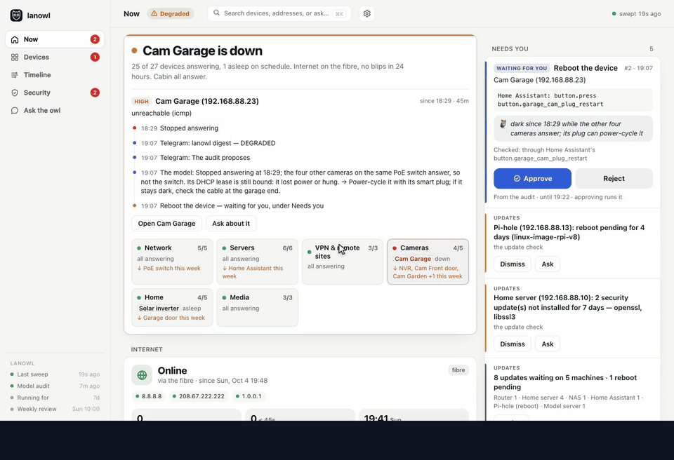
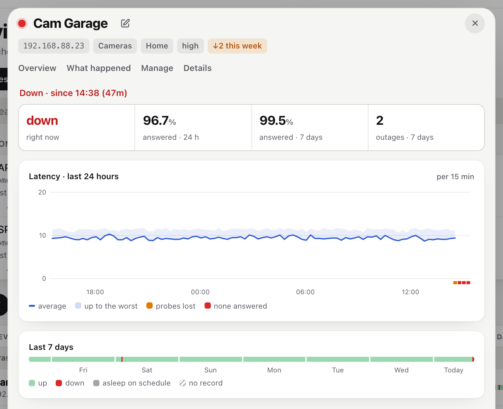
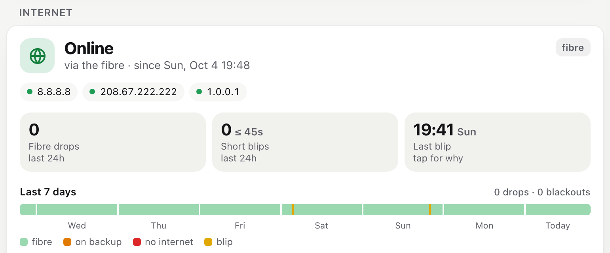
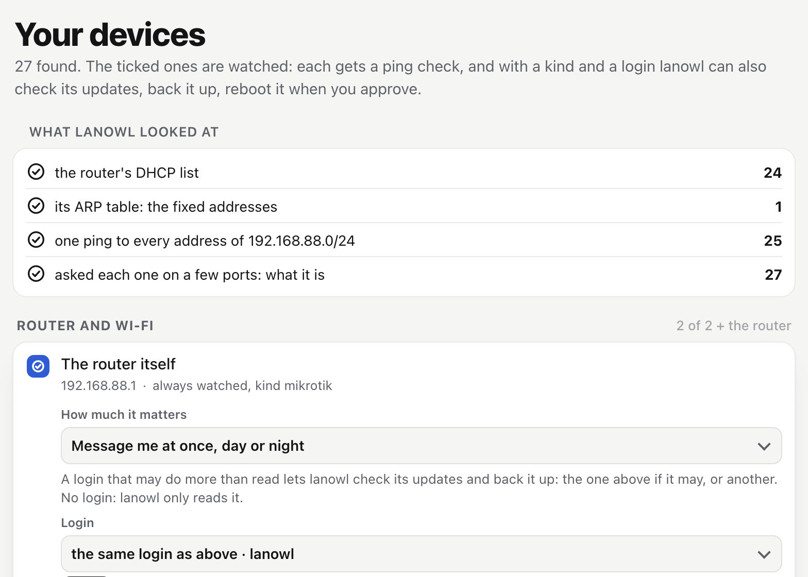
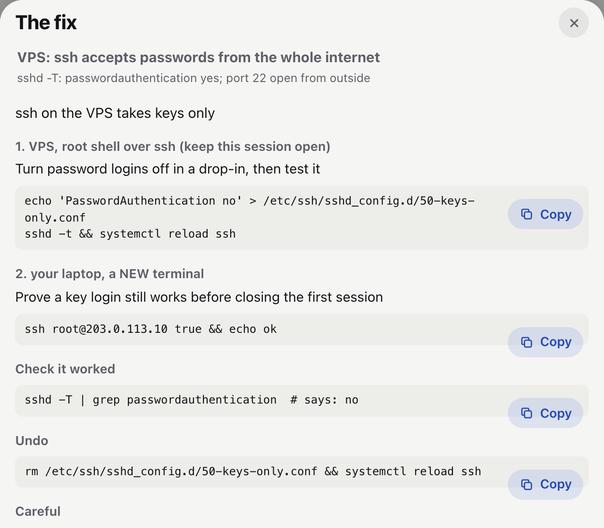
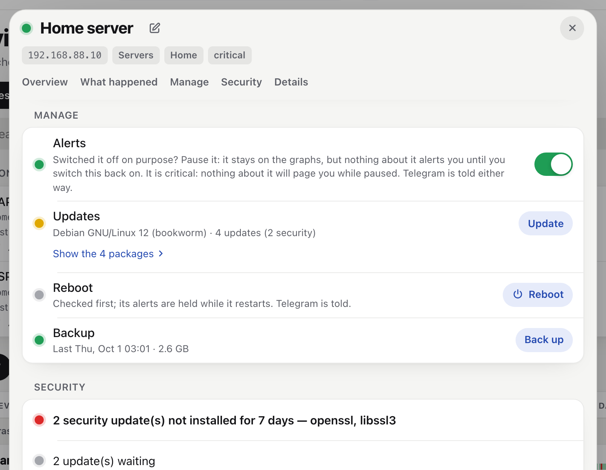
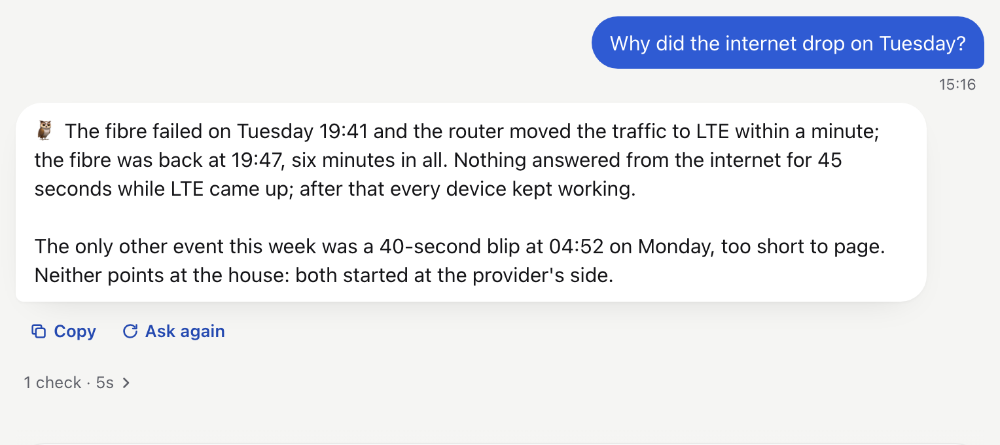
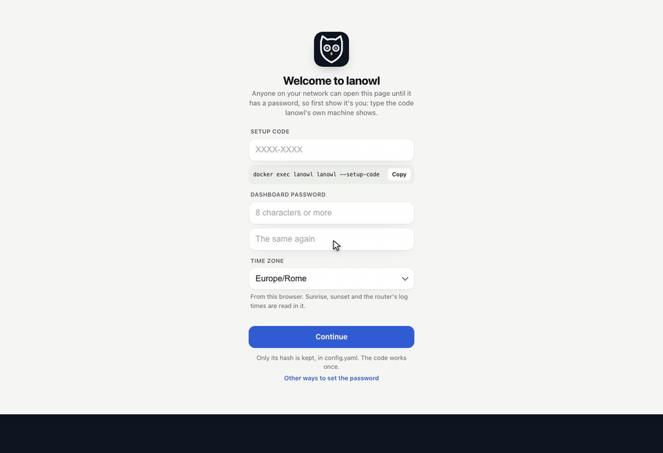

# lanowl 🦉

**The self-hosted AI network monitor. Your monitor says it's down. lanowl tells you why.**

lanowl checks every device on your network once a minute and tells you **once per incident**,
not once per blip. When something breaks, a local model, the owl, investigates with read-only
tools and writes the cause into the alert you already have: the switch, the line, the update,
the Wi-Fi. It changes nothing by itself: a fix is a proposal that runs only when you press a
button.



Free and open source (AGPL-3.0). Self-hosted, no account, no telemetry. The model runs on
your own [Ollama](https://ollama.com); everything else works without it.

**[Documentation](docs/README.md)** · [Quick start](docs/getting-started/quick-start.md) ·
[How alerts work](docs/using/alerts.md) · [The security model](docs/reference/security-model.md)

**Set it up with your AI assistant.** No YAML to learn: describe your network to Claude,
ChatGPT, Gemini or any other assistant, give it the example files, and it writes your
configuration. `lanowl --check` tells you both what to fix, and your passwords stay on your
machine. [The prompt to copy](docs/getting-started/with-an-ai.md).

> **Status: pre-alpha.** lanowl comes out of a monitor that has run a real home network
> (MikroTik, OpenWrt, Linux servers, Shelly, cameras, a VPS hub, two remote sites) since
> August 2026. It is being turned into something anyone can install, and is not ready yet.

## What it does

Besides telling you why, lanowl looks after the whole network from one install. What it does
with a device besides watching it (updates, reboots, backups, security) is ticked device by
device, and nothing that changes a device runs without your button.

### Watches every device

- Every device, every minute: ping, TCP, HTTP, SNMP. A device that ignores ping is still seen,
  in the router's ARP table or by its switch port's link.
- Two misses in a row before anything is down. A dead switch is one message, not twelve.
- One message per incident, and one when it is over. A flapping line pages once, then says
  "unstable for 3h · 5 outages" when it settles.
- Solar gear asleep at night never pages. A device you switched off for a holiday is paused,
  not down.
- Once a day the owl reads the week's numbers and names what is slowly getting worse: a camera
  that drops every night at 02:00, a line that flaps a little more each week.
- A weekly review: the internet's week, the devices that kept falling off, what joined.



### The internet

- A 15-second ping loop, the router's log as it is written and its route table: `ok`, `on
  backup` or `down`. A failover to your backup line is not "no internet".
- Every blip keeps its evidence, so "where did it break?" has an answer: your line, the
  provider, or lanowl's own view.
- With no internet, messages wait and go out when it is back, with the real times in them.
- A speed test of the line, or of a remote site's line, when you ask for one.



### Finds every device

- A new device the owl finds worth it gets one message: its name, MAC and maker (from an offline list), or "a
  private address" for a phone's random MAC, and whether it came by DHCP or has a fixed address.
- It reads the router's DHCP leases, its ARP table for the fixed addresses no DHCP lists, and
  once a month asks each network "who is there" for the silent ones.
- A device DHCP moved to another address is followed by its MAC.
- Each unknown device has two buttons: Watch (ping it from now on) or Known.
- The first-run setup's Find my devices reads the router, pings the network once and asks a
  few ports what each device is ("port 8123 answers: Home Assistant").
- The same on remote sites, through their own routers.



### Security checks

- Every morning the owl reviews what each machine exposes: who may log in and how, what
  listens, the firewall, the management services and where they answer from, UPnP, an open
  resolver, firmware out of support. It also looks from the outside, through your VPS.
- Each finding has a written fix for that machine: the steps in an order that cannot lock you
  out, how to check it, how to undo it. You apply it; nothing runs.
- The auth logs of your Linux machines every two minutes, and the router's log: a burst of
  failed logins, a login from an address you do not trust, a flood of connections is an
  alert at once.
- What changed since yesterday: a firewall rule, a user, an ssh key, a port forward, a
  crontab, a VPN peer, with the owl's word on how risky it is.
- A monthly vulnerability scan. Each CVE it matches is checked against the exact package
  installed (OSV.dev, NVD) and against the machine's own settings: only the real ones page.
- An insecure service newly open (telnet, ftp) pages once.



### Updates, reboots, backups

- Every morning, what is waiting: apt, RouterOS (and whether a version in between was a
  security release), Home Assistant with its add-ons and the firmware it knows, ESXi,
  OpenWrt, UniFi, your own kinds.
- It pages only when it matters: a security update waiting 2 days, a reboot pending for 3.
- Install with a button: an apt upgrade or a RouterOS update, with a backup first when
  backups are on. A failed backup stops the update.
- Reboot with a button: RouterOS, ssh, a camera's API, Home Assistant, a Shelly (its relays
  never switch), or any device through its smart plug. Its alerts wait until it is back.
- Restart a service with a button.
- Monthly backups onto a disk of yours, and one before every update: MikroTik exports and
  binary backups, Home Assistant's full backup, Linux configuration files, the ESXi host and
  every VM's settings, every Shelly's settings and scripts. lanowl backs itself up every day.



### Troubleshooting

- Every incident is investigated: the device's history, its neighbours, the router (DHCP, ARP,
  a port's link, its log), the machine's own log. The cause goes into the alert.
- Ask it anything, on Telegram or the dashboard: "why did the internet drop on Friday?",
  "what did you restart last week?". It remembers what you tell it.
- 42 diagnostics it runs for you: mtr, traceroute, DNS compared across resolvers, TLS, HTTP
  timing, packet headers, a ping sweep, nmap, a machine's load, disks and failed services.
  From lanowl, another LAN host, your VPS (the internet's view, the WireGuard peers), a remote
  site's router, and the router itself (its ping, traceroute, and torch: which device is
  using the bandwidth).
- A sandboxed shell, with no keys in it, when a hunch needs one.
- It grades its own diagnoses once a problem is over, so you know how far to trust it.



### Around it

- Telegram: alerts, Approve buttons, and `/status`, `/security`, `/updates`, `/backups`,
  `/reboot`, `/pause`, `/week`.
- Its own dashboard, served by lanowl itself, so it works when the internet
  does not. Settings change every file from there.
- Remote sites over WireGuard: their DHCP, their devices, checks from their routers.
- Results on MQTT, and a heartbeat for a watchdog on another machine.
- Built-in kinds: MikroTik, OpenWrt, Linux, ESXi, UniFi, Home Assistant, Reolink, Shelly, and
  macOS as a profile. Any other kind is a YAML profile: a command per operation, never code.

## Quick start (Docker)

No file to copy or edit:

```bash
git clone https://github.com/alessandromatera/lanowl && cd lanowl
docker compose -f docker/compose.yaml up -d
docker exec lanowl lanowl --setup-code
```

At its first start lanowl writes its own `config.yaml`, `inventory.yaml`, `secrets.yaml` and
ssh key into the empty `config/` folder. Then open `http://<this host>:8088/` and the page sets
it up:



1. **The setup code** the last command printed, then a password of yours. Only its hash is
   kept.
2. **Your router.** Its address is found for you, and a read-only user is enough: the page
   gives the two RouterOS lines that make one. **Try the router** logs in and counts its DHCP
   list.
3. **Find my devices.** The router's DHCP list, its ARP table (the fixed addresses), one ping
   to every address and a few ports on each: what each device is, and why lanowl thinks so.
   Half a minute, and nothing is changed.
4. **Logins.** Tick what to watch. Give a login to what lanowl may update, back up or reboot:
   **Try** asks the device and quotes its answer.
5. **Telegram.** A bot from @BotFather, its token, then `/start` from your phone. Optional.
6. **Write.** What it will do, and every change to the three files, checked first. Then it
   restarts and watches.

The owl stays off until you tell lanowl where Ollama runs (Settings → The model): nothing
warns about a model you have not set up. Everything else in `config.yaml`, every login and
every token can be changed from the gear, too; a password or a token goes in and is never
shown again. On Linux, allow unprivileged ping first
(`sysctl -w net.ipv4.ping_group_range="0 2147483647"`), or every device reads DOWN.

Rather write the files yourself, or have an AI assistant write them from a description of your
network? Copy the examples into `config/` instead: [Quick start](docs/getting-started/quick-start.md),
[Set it up with an AI assistant](docs/getting-started/with-an-ai.md).

What lanowl will do with each device, and why not:

```bash
docker compose -f docker/compose.yaml run --rm lanowl lanowl --check
```

A dry run, one sweep printed and nothing sent:

```bash
docker compose -f docker/compose.yaml run --rm lanowl python -m lanowl.main --once --no-llm --no-mqtt --no-telegram
```

## Configure

Three files, all under `config/`, written by lanowl at its first start and changed from the
dashboard's gear (or by hand):

| file | what | shared? |
|---|---|---|
| `config.yaml` | everything lanowl does, with every optional feature off | yes |
| `inventory.yaml` | the devices: how each is watched, and what lanowl does with it | yes |
| `secrets.yaml` | every secret: device logins, tokens, lanowl's ssh key; mode 600, write-only from the dashboard | **never** |
| `profiles/` | device kinds of your own (optional) | yes |

Two settings shape how the owl thinks:

- **`network.description`**: a few sentences about your network, in your own words: the
  links, the sites, what runs where, what you chose on purpose. Every prompt gets it.
- **`model.persona`**: `owl` (the default), or `""` for plain prose. The owl's voice is
  calm and brief and never changes a severity; its words carry 🦉, the monitor's keep 🔴🟡🟢.

**A backup internet link** is optional. Without `wan.path.route_comment` lanowl assumes one
line, and nothing speaks of failover. With it (a MikroTik dual-WAN), name your links
(`wan.path.main` / `backup`) and every message uses those names.

## The router (MikroTik)

With a MikroTik as the main router, lanowl reads it: the DHCP leases (new devices, a device
DHCP moved), the routes (which internet link is in use), ARP and the ports' link state (for
gear that does not answer ping) and the log (the failover's own lines, logins). Everything
else works without it: leave `mikrotik.dhcp_source` empty.

On the router, a user that can read and nothing more, allowed only from lanowl's host
(here `192.168.88.5`; older RouterOS calls a service's `available-from` `address`):

```
/user group add name=lanowl-ro policy=read,test,sniff,api,rest-api
/user add name=lanowl group=lanowl-ro address=192.168.88.5/32 password="a long one"
/ip service set www available-from=192.168.88.5/32
```

`test` and `sniff` let the model ping, traceroute and torch from the router when you ask it
to look into something; leave them out and it simply cannot. lanowl watches its own group:
a change to it that grants more than `mikrotik.lanowl_policy` is reported like any other
configuration change.

Then type its address (`192.168.88.1`; the setup fills in your gateway), the user and the
password in the first-run setup (or Settings → Add from the router's list), which also gives
the first two lines above with lanowl's address filled in. The third keeps WebFig over plain
HTTP from your own computer out too: yours to choose. By hand instead: in `config.yaml`, `mikrotik.dhcp_source:
"http://192.168.88.1"` and `mikrotik.credentials: router-read`, and in `secrets.yaml` that
login: `router-read: {user: lanowl, password: "a long one"}`.

**One kept connection instead of polling** (recommended): the API over TLS. RouterOS will
not self-sign a server certificate ("CA not found"), so a small local CA signs it:

```
/certificate add name=lanowl-ca common-name=lanowl-ca key-usage=key-cert-sign,crl-sign days-valid=3650
/certificate sign lanowl-ca
/certificate add name=lanowl-api common-name=192.168.88.1 subject-alt-name=IP:192.168.88.1 days-valid=3650
/certificate sign lanowl-api ca=lanowl-ca
/ip service set api-ssl certificate=lanowl-api available-from=192.168.88.5/32 disabled=no
```

and `mikrotik.api.enabled: true`. The certificate is self-signed, so lanowl trusts it by its
fingerprint: on the first connection the log says `router API: pin this certificate:
mikrotik.api.fingerprint: …` — put that value in config.yaml. Until then the link is
encrypted but not authenticated.

If the router refuses the login, lanowl says so once — check the password and the user's
`address=` — and does not try again for 15 minutes, or until secrets.yaml changes: every
refused try is a `login failure` line in the router's log.

**A failover script** (dual WAN): put a comment on the main link's default route
(`wan.path.route_comment`), and give `wan.watch.log_down_match` / `log_up_match` the lines
your script logs when the main link goes down and up. A backup that switches its own uplink
on only when the router fails over to it (an LTE or radio link) is `wan.path.backup_standby:
true`, and `wan.standby` reads it while the main link is down.

## Devices

Each device is described once, in the inventory. Watching it needs only an address and its
checks. What lanowl does with it besides is set on the device too:

```yaml
- ip: 192.168.88.1
  name: Router
  kind: mikrotik                 # what it is
  credentials: routers           # its login, by name, in secrets.yaml
  manage: [updates, upgrade, reboot, config, security, backup]
```

| feature | what lanowl does |
|---|---|
| `logs` | reads its auth log for security events |
| `updates` | checks its updates every morning |
| `upgrade` | may propose installing them |
| `reboot` | may propose a reboot |
| `restart` | may propose restarting one of its listed services |
| `config` | tells what changed in its configuration |
| `security` | reviews what it exposes, every day |
| `backup` | backs it up, monthly and before updates |

Built-in kinds and what each can do:

| kind | logs | updates | upgrade | reboot | restart | config | security | backup |
|---|:-:|:-:|:-:|:-:|:-:|:-:|:-:|:-:|
| `mikrotik` | | ✓ | ✓ | ✓ | | ✓ | ✓ | ✓ |
| `openwrt` | | ✓ | | ✓ | | | ✓ | |
| `linux` | ✓ | ✓ | ✓ | ✓ | ✓ | ✓ | ✓ | ✓ |
| `esxi` | | ✓ | | | | | ✓ | ✓ |
| `unifi` | | ✓ | | ✓ | | | | |
| `homeassistant` | | ✓ | | ✓ | | | | ✓ |
| `reolink` | | | | ✓ | | | | |
| `shelly` | | | | ✓ | | | | ✓ |
| `generic` | | | | | | | | |

Any device can be rebooted through a Home Assistant button (a smart plug): give it a `kind`
(`generic` is enough), `manage: [reboot]` and `reboot: {ha_button: button.nvr_plug_restart}`.
A feature's options sit under its name: `restart: {units: [mosquitto]}`,
`backup: {paths: [etc, home]}`, `reboot: {risk: "...", hold_min: 10}`,
`logs: {public: true, about: "..."}`.

**Logins** (`secrets.yaml`) are a user with a password, lanowl's ssh key (`key: true`), or both
(the key logs in, the password is what sudo asks for). A user other than root needs sudo for
what reads or changes the system.

**Every secret** is in `secrets.yaml`, read again when it changes: the device logins, the
Telegram and Home Assistant tokens (`tokens:`), the logins lanowl reads the router and the
MQTT broker with (named by `mikrotik.credentials` and `mqtt.credentials`), and lanowl's ssh key
(`ssh_key:`). A deployment may give lanowl's own secrets in the environment instead
(`LANOWL_TG_TOKEN`, `LANOWL_HA_TOKEN`, `LANOWL_MIKROTIK_USER`/`_PASS`, `LANOWL_MQTT_USER`/`_PASS`,
`LANOWL_SSH_KEY`), or as Docker secrets through `<name>_FILE`. `lanowl --check` says where
each one comes from, never its value.

**A kind of your own** is a profile: `config/profiles/<kind>.yaml`, a command per operation
and a fixed parser for what it prints, never code. lanowl ships `macos` as one; copy it:

```yaml
kind: macos
ops:
  version:  {cmd: "sw_vers -productName; sw_vers -productVersion", parse: lines}
  updates:  {cmd: "softwareupdate --list 2>&1", parse: {regex: '^\* Label: (?P<pkg>.+)$'}}
  uptime:   {cmd: "sysctl -n kern.boottime", parse: boottime}
  reboot:   {cmd: "shutdown -r now", sudo: true, back_s: 600}
  config:   {cmd: "scutil --get ComputerName; pmset -g custom"}
  security: {cmd: "fdesetup status; csrutil status; spctl --status"}
```

Operations: `version`, `updates`, `uptime`, `reboot`, `config`, `security`, `backup`.
Parsers: `text`, `lines`, `first_line`, `seconds`, `proc_uptime`, `boottime`, `{regex: ...}`.

## The model

Any [Ollama](https://ollama.com) model with tool calling, set in config.yaml's `model:`
section (`url`, `name`). A larger model reasons better: a 27–35B model on a 32–64 GB machine
is comfortable. Without a model everything still works:
detection, alerts, digests, the dashboard. The switch on the dashboard (or `/model off`)
puts the owl to sleep.

## Safety

- Read-only unless you press a button; actions are a fixed catalog, validated before they run.
- The model never sees a password; logins reach ssh through `SSH_ASKPASS`, never argv.
- The model's shells are sandboxes beside lanowl, with no key, no config and no state; their
  walls are proven before the tool is offered.
- The dashboard is closed until you log in with its password, kept only as a hash; it accepts
  only JSON POSTs and IP-literal `Host` headers.

## License

AGPL-3.0. See [LICENSE](LICENSE).
