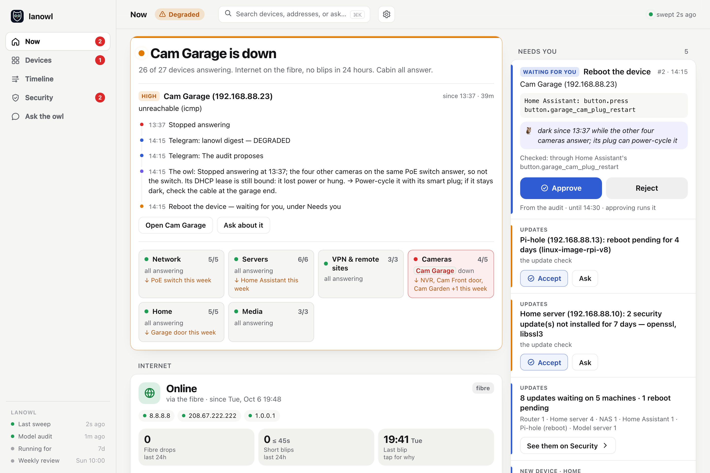
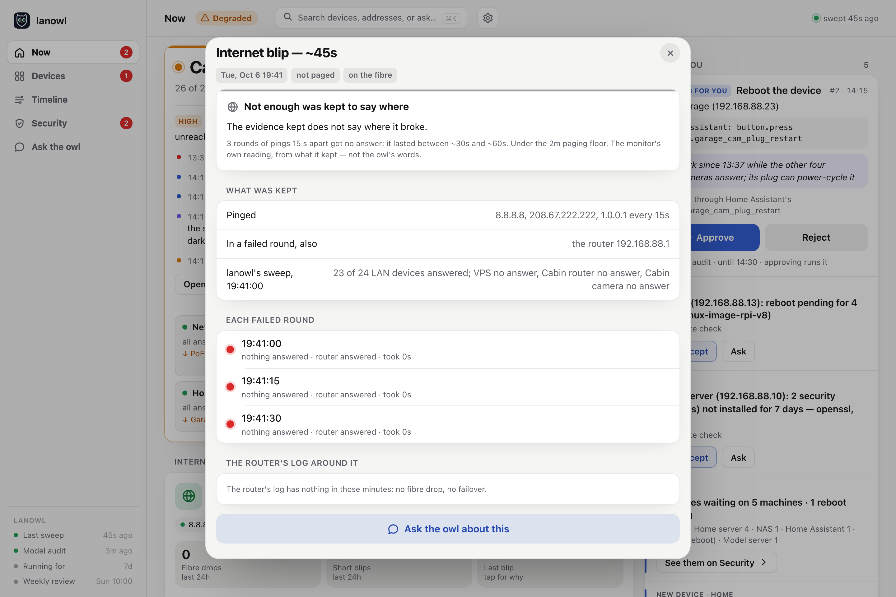
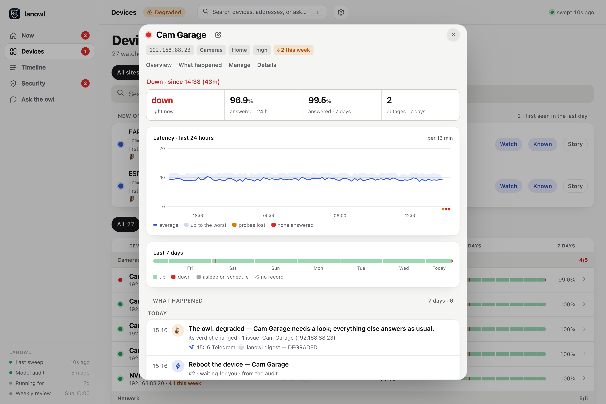
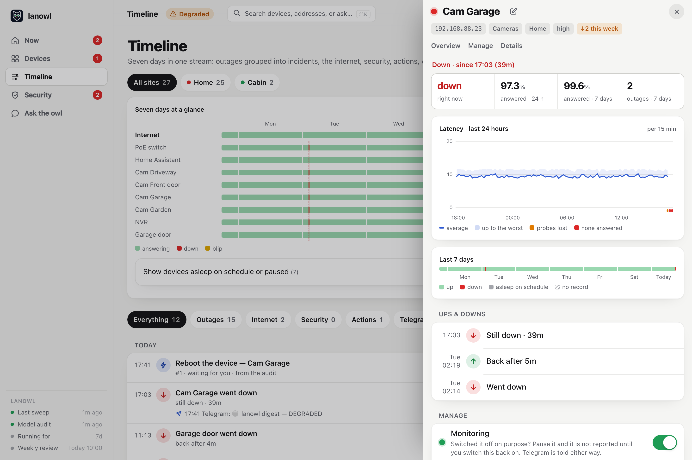
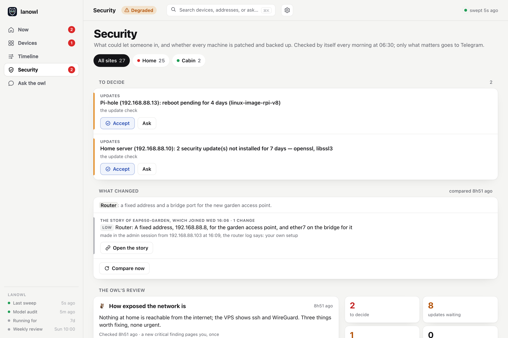
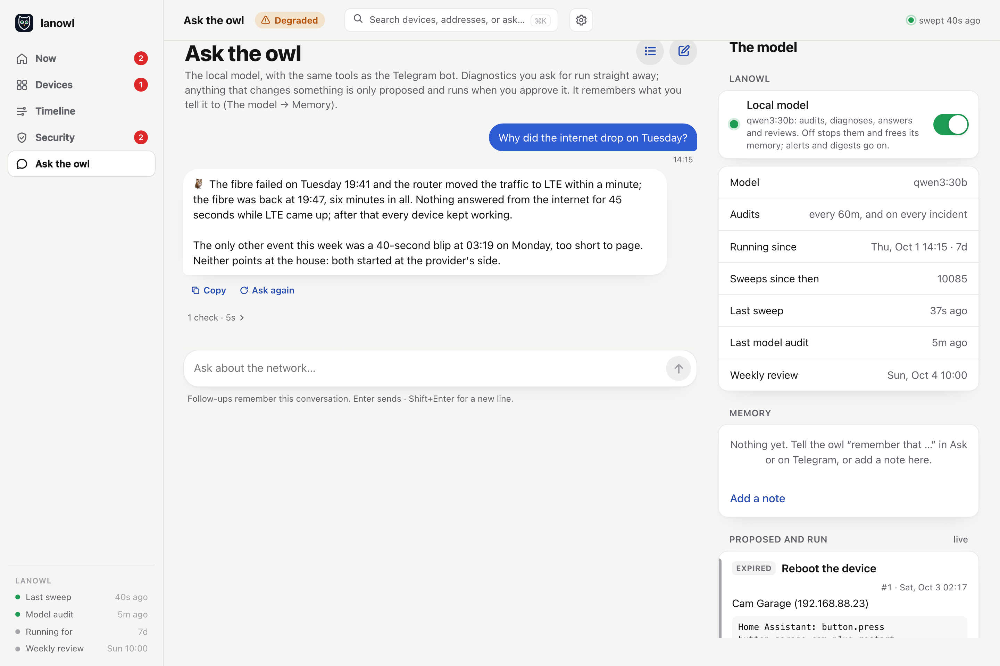

# The dashboard

lanowl serves its own dashboard, at `http://<lanowl's host>/` (port `web.port`). It needs no
internet and loads nothing from anywhere else, so it works precisely when the internet does
not. It is made for a phone first: add it to your home screen and it opens like an app. On a
computer the tabs sit in a sidebar, with lanowl's own vitals under them (last sweep, last
audit, how long it has been running).

**Search** (⌘K, or the magnifier on a phone) finds devices by name or address, the Timeline's
events, messages and log checks, jumps to a tab, or sends what you typed to the owl as a
question.

Each thing has one home, and the other tabs link to it: a security item to decide lives under
Security → To decide (Now's Needs you is the same list, with the same buttons), a story on the
Timeline. When a site is picked (Home, the office…), every tab it
filters says so in a blue line, with **Show all sites**.

It is closed until you log in: see [Logging in](#logging-in). The **gear** in the header opens
[Settings](settings.md): config.yaml, your devices, and the first-run setup.



## Now

What needs you, first.

- **The headline** says the state of the network in one line: "Cam Garage is down", "All
  clear", and how many of all devices answer (asleep and paused said apart, the same count as
  the digest's), the internet, and each site.
- **The incident card**, when there is one: the problem, its severity, since when, and its
  trail: when it stopped answering, what Telegram was told about this incident (with the day,
  when not today), the owl's diagnosis, a proposal waiting for you. A service that fails every
  other minute stays on it, marked as coming and going, until its incident is over. **Open**
  shows the device; **Ask about it** starts a question with its facts.
- **Groups**: one tile per group, with what is down and what went down this week.
- **Needs you**: proposals waiting for your approval, the security findings that matter (each
  saying what story it is part of, with **Open the story**), updates waiting, and each device on
  a network for the first time by name, with what the owl said of it. Buttons that change
  something are blue with a tick; the ones that only open something end with an arrow.
- **Internet**: online, on the backup line, or down, through which link, the targets' answers,
  drops and blips in 24 hours, and seven days as a bar. Tap an event to see where it broke.
- **Sites**: each site with its devices answering and its unnamed devices.
- **The owl**: what it says now (its last audit), what is getting worse this week (its own
  look at the week and the monitor's numbers: the same list the digest carries; gear asleep on
  schedule is left out), **What it said before** (each change of mind in the last day), a box
  for a follow-up question, and **Audit now** (the digest goes to Telegram too). When the
  monitor's reading now differs from the owl's, the card says so.



## Devices

Every watched device, grouped, with its state now, its latency over 24 hours and seven days
of answers. **New on your networks** comes first while anything is new: each with what the owl
said of it, the message that went out, and a note when its name looks like a device you
watch (the name only: lanowl does not decide they are one device). Filter by site, by what is down, by what went down this week, by what is asleep,
or sort the least stable first. Under the list: each site's DHCP devices that nobody watches,
with **Watch** and **Known**, and every named service. **Watch** writes the device into
`inventory.yaml` (after a sheet that names the change) and pings it at once: it is on the page
when the sheet closes, no restart needed. **Known** only stops it counting as unknown.

Tap a device for its sheet (centered on a computer, rising from the bottom on a phone). Tap
a warning, a log check or a configuration change anywhere, and its machine's sheet opens at that
item, under **What happened**:

- **Overview**: down since when, the share of answers in 24 hours and seven days, its
  outages, a latency chart with lost probes, seven days as a bar.
- **What happened**: its own seven days, by day: outages, the messages about them, the log checks
  that name it, its configuration's changes, actions, and the owl's verdicts that named it.
- **Manage**: its **Alerts** switch, to pause it (still pinged and graphed, no alerts:
  [Pausing a device](pausing.md); Telegram is told), and the actions its kind allows, such as
  Reboot or Update, each confirmed in a sheet that says what runs.
- **Details**: its checks, its kind, its login type, and what lanowl may do with it and why
  not.
- The pencil renames it. The inventory's name stays underneath.



## Timeline

Seven days, everything lanowl saw, said and did: outages grouped into incidents, the
internet, security events and log checks, the configurations' changes, the owl's verdicts (each
time they changed), actions, new devices and every Telegram message. **Everything** shows all
of it: the routine rows are drawn quiet, never left out.

Each event carries what was said about it: the Telegram message about it sits under it, not
apart; a new device carries what the owl said and **the same story**, the log checks and
configuration changes that name its address, MAC or name within a day, or a network those
name, each saying why it is there. A log check opens to the lines it read. An approval says
which browser it came from.

Filter by kind: Outages, Internet, Security & logs, The owl, New devices, Actions, Telegram.
Tapping an action opens it in a sheet (its steps, what it found, its buttons); tapping anything
about a device opens that device's sheet at it.
**Seven days at a glance** (a lane per device, moments when several went down together shaded)
is folded to one line; **Show the lanes** opens it.



## Security

What could let someone in, and whether every machine is patched and backed up.

- **To decide**: what matters, first, each saying what story it is part of.
- **What changed**: configuration changes since yesterday, with the owl's reading of each, the
  worst first; the changes of one story (a route that names a new device, the VPN peer for its
  network) are one card. **Compare now** runs it.
- **The owl's review**: this morning's summary (what you accepted is said once, apart), **Check
  now** (updates, then the review) and **Deep scan** (the monthly vulnerability scan, now).
- **Log checks**: every one of the last 48 hours, the problems first, each opening to the lines
  it read; and each public host's ssh scanners, counted.
- **Worth fixing, not urgent**: the rest. **How to fix** shows the owl's written fix for you
  to apply yourself; **Accept** takes it off the list until it changes (with a note, if you
  like).
- **Machines**: per machine, its updates, its last backup, the review's findings, the deep scan
  and how long it has been up, with **Update** or **Reboot** where they apply.
- **Backups**: where they go, when the next run is, and **Back up everything now**.
- **Accepted and handled**: what you accepted, and the security events you marked handled
  ("It was me" or "Fixed").



More: [Updates, backups and the security review](security.md).

## Ask the owl

A conversation with the model, with the same tools as the Telegram bot. You watch it work:
its thinking, each check as it runs, and the answer as it is written. **Stop** stops it;
**Ask again** retries; follow-ups remember the conversation. Earlier conversations are kept
across restarts, so one started on the phone can go on at the computer.

Beside it, the model's side:

- **Local model**: the switch that puts the owl to sleep and wakes it, the model's name, when
  it audits, and when it last did.
- **Memory**: the notes it keeps. Add, edit or forget them.
- **Proposed and run**: everything it proposed, what you decided, and what happened.
- **Track record**: each diagnosis, checked with hindsight once the problem was over.
- **The model's shell**: its two sandboxes' daily check (fenced off from your network; only a
  failed check reaches Needs you) and every command they ran.



More: [Asking the owl](asking.md).

## Logging in

The dashboard has one password, and no user name. Until it has one, it asks for a **setup
code** and then the password. The code proves you can reach lanowl's machine, not just the
page; lanowl makes it at its first start and prints it on request:

```bash
docker exec lanowl lanowl --setup-code
```

The code works once. The password's hash goes into `config.yaml` (`web.password_hash`), and
the dashboard opens on the [first-run setup](settings.md#the-first-run-setup). The other ways
to set a password:

- **Telegram:** send `/password` to the bot, then the password (8 characters or more). The
  bot deletes your message as soon as it has read it and keeps only a hash. `/password`
  again changes it.
- **config.yaml:** make a hash, and put the line it prints under `web:`, then restart lanowl.

```bash
docker compose -f docker/compose.yaml run --rm lanowl lanowl --hash-password
```

```yaml
web:
  password_hash: "scrypt$32768$8$1$…"
```

A password in `config.yaml` wins: `/password` then only points to it. `lanowl --check` says
where the password comes from, or that there is none.

A browser stays logged in for 30 days after its last visit, across restarts and upgrades of
lanowl. **Log out** and **Log out everywhere** are in the Ask tab, under lanowl. A new
password, from either place, logs every browser out.

Five wrong passwords in a row lock the login for 15 minutes, for every browser, and Telegram
is told once, with the address the last try came from. `/password` sets a new one and lifts
the lock. A good login sends nothing.

The login is a cookie, so the password crosses your network only when you log in. Over plain
HTTP anyone who can watch your LAN's traffic could read it then; put lanowl behind a reverse
proxy with HTTPS if that matters to you (and list its name in `web.allowed_hosts`).

`web.login: false` switches the login off, for a dashboard that already sits behind a login of
your own (Authelia, Authentik, Tailscale). `--check` says so while it is off.

## Approving

Anything on the dashboard that changes something (approving a proposal, a reboot, an update)
opens a sheet that says what runs, on which device, and the risk; your tap on its button is
the approval. lanowl records which browser approved or rejected it (its address, what it is,
and a short tag of its login), shown on the Timeline and in Ask's Proposed and run; when an
approved action has run, the Telegram line that says so names it too. Reject, End and Cancel need no sheet: they can only stop something. There is no
PIN: the page is behind its login.

## Who can reach it

Only a browser logged in with the password. Keep it on your LAN all the same. It accepts only
JSON requests and IP-address host names, which stops another web page from driving it through
your browser. Pausing a device is told on Telegram, and so is every save in Settings.
